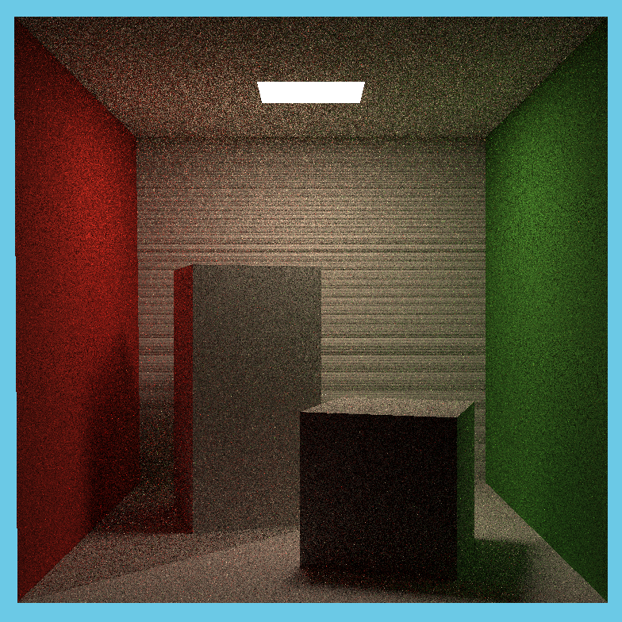

# GAMES101 Assignment 7 - Path Tracing

This assignment extends the BVH-accelerated ray tracer with Monte Carlo path tracing for the Cornell Box scene.

## Completed work

- Restored ray-triangle intersection data, ray-AABB intersection, and recursive BVH traversal from Assignment 6.
- Implemented uniform area sampling over emissive geometry in `Scene::sampleLight` with the correct total-area PDF.
- Implemented direct lighting with a shadow ray to the sampled light point.
- Implemented indirect lighting by sampling the diffuse BRDF hemisphere and applying Russian Roulette termination.
- Returned emitted radiance for camera rays that directly hit the area light, making the light visible.
- Kept the required 784 x 784 resolution and SPP 16, which exceeds the minimum SPP 8 requirement.

## Build and run

Use an MSYS2 MinGW64 terminal from this directory:

```powershell
cmake -S . -B build -G "MinGW Makefiles" -DCMAKE_BUILD_TYPE=Release
cmake --build build
cd build
.\RayTracing.exe
```

The renderer writes `build/binary.ppm`. The included reference result took about 19 seconds on this machine at SPP 16.

## Result



## Notes

The image remains visibly noisy because path tracing is stochastic and the sample count is intentionally kept at 16 for practical runtime. Increasing `spp` in `Renderer.cpp` reduces noise at a proportional time cost. Multithreaded ray generation and Microfacet materials are optional bonus tasks and are not included.
